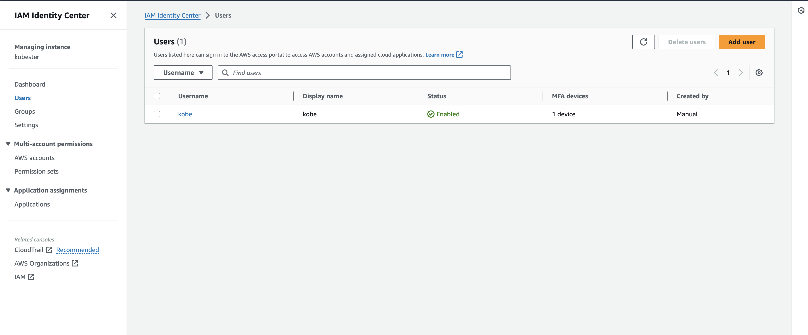

# cs732 assignment
This is for cs732 assignment tech demo, the topic of this assignment is to illustrate the feasures of Angular, React and make comparisons with Angular, on top of that have set up Amazon Web Services (AWS) account and the repository is deployed on AWS Amplify for application deployment, CI/CD and mornitoring. The solution also leveraged Bootstrap for css styling. 

navigate to angular-app folder for techdemo assignment.

Description:
1. 

Before you begin:
1. Check node version
    node -v
2. Install correct version of node.js for angular
    Download link: https://nodejs.org/en/download/
3. Install latest version of Angular
    npm install -g @angular/cli
4. Install bootstrap
    npm i bootstrap@5.3.3
5. install required npm dependencies
    npm install
   

To Start the  application
0. Navigate to angular-app folder
    cd angular-app
1. start the server
    ng serve
2. direct to local host 
    http://localhost:4200/home

 
Set up AWS Account for AWS Amplify:
1. Create an AWS Account 
2. Navigate to Account Settings, which you should be logged in as management account. 
3. Go to AWS Organizations -> AWS Accounts.
4. Create a new environment called 'dev' along side management account under Root.
5. Navigate to IAM Identity Centre, select ap-southeast-2 Sydney as Region.
6. Enable IAM Identity Centre
7. After Identity Centre is enabled, select Dashboard -> Users
8. Create a new user (your name), then add the user into the new account 'dev'
9. Then log in as the new user (your name) to complete the registration.

10. In management account, Navigate to Organizations -> AWS accounts -> Invitations -> Invite AWS Account. 

11. Add the new user (your name) to the 'dev' account, and create group (admin) with Admin permission then add the new user into this group. 
12. SSO will be automatically enabled now if you log in to 'dev' account, Click on AdministratorAccess link and you will be directed to AWS console. 

Set up Amplify:
0. Make sure Git repo, Anguar app and AWS account set up properly
1. Open Amplify console on AWS 'dev' account
2. Choose Get Started at the top of the page, at the bottom of the page, locate the Amplify Hosting section, and choose Get started.
3. On the Get started with Amplify Hosting page, choose your Git repository provider, then choose Continue.
4. On the Add repository branch page,  the Recently updated repositories list, select the name of the repository to connect, for our case it's cs732-techdemo.
5. In the Branch list, select the repository cs732-techdemo main branch to connect, then click next.
6. Confirm build settings, and make sure to match below settings.

7. Deploy the application to AWS CDN (Content Delivery Network). On the Review page, confirm that your repository details are correct.

8. Set up Pull request previews, Choose App settings, Previews and then choose Enable previews. In the Install GitHub App to enable previews window, choose Install GitHub app, Select the GitHub account where you want to configure the Amplify GitHub App. A page opens on Github.com to configure repository permissions for your account. To limit the installation to the specific repositories that you select, choose Only select repositories, and select 'cs732-techdemo'. Choose Save.

